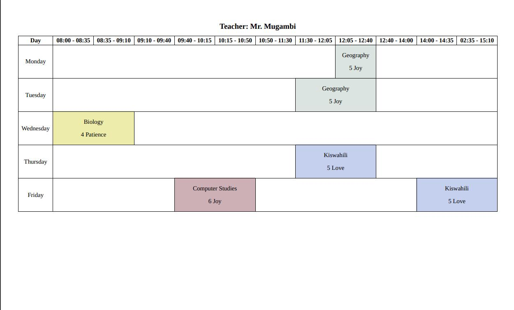
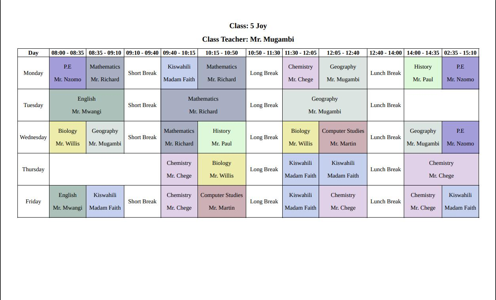

# 🕒 Timetable Generator

Say goodbye to the chaos of manual timetable creation!

## 📸 Screenshots

## ✨ Features

- **Custom Teacher Routines**: Specify non-continuous schedules for teachers on any day. By default, aligns with the group’s routine.
- **Lesson Limits**: Cap the number of lessons in a class.
- **Mandatory Lessons**: Lock in lessons at specific times.
- **Group Handling**: Seamlessly manage groups with different routines.
- **Eye-catching Layouts**: Color-coded, legible, and visually appealing timetables.
- **Customizable Days**: Choose which days to include for groups.
- **Dual View**: Generate teacher-wise and class-wise timetables effortlessly.

## 🚀 Usage

Three ways to get started:

1. **Local Build**:

   - Install [Go](https://go.dev/doc/install) & Chromium (ensure both are in your system PATH).
   - Run the server (default port: `1323`; pass a custom port if needed).

2. **Docker**:

   - Use the included `Dockerfile` (Docker must be installed).
   - Starts the server, accessible at port `1323`.

3. **Live URL**:
   - Great for testing. ⚠️ Not recommended for production.

## 🛠️ Development

Ensure you have these tools ready:

- **[Go](https://go.dev/doc/install)**: Compatible with version `1.23.1`.
- **[golangci-lint](https://golangci-lint.run/)**: Compatible with version `1.61.0`.
- **[Redocly CLI](https://redocly.com/docs/redocly-openapi/installation/)**: Compatible with version `1.25.3`.

## 🤝 Contributions

- **Report Issues**: Include clear steps to reproduce the problem.
- **Customize**: Fork/clone the repo and tailor it to your needs.
